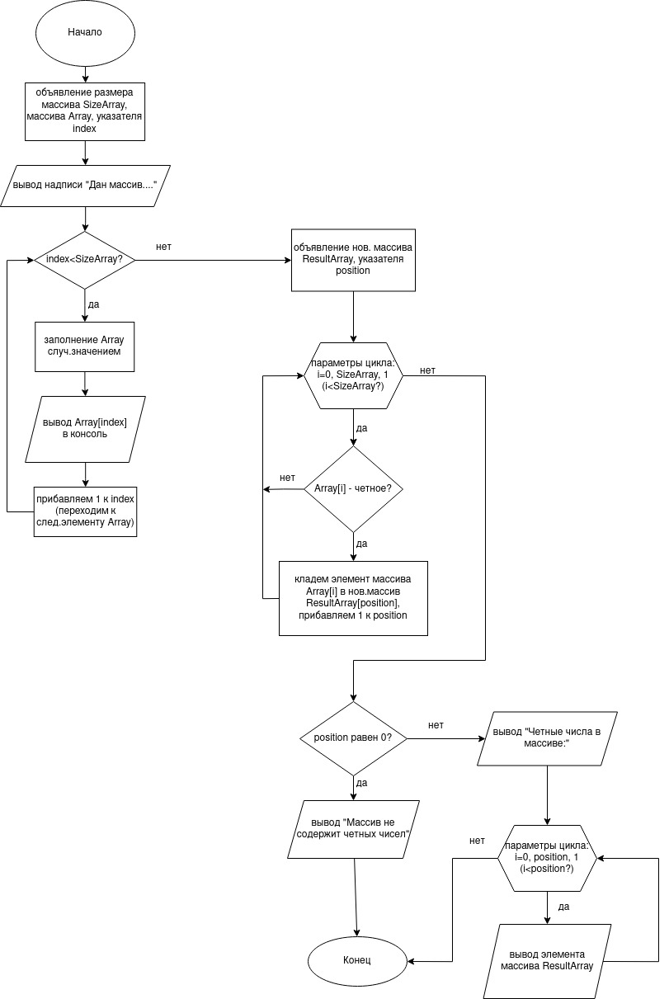

# Задача.
Написать программу, которая из имеющегося массива целых чисел формирует массив из четных чисел. Первоначальный массив можно ввести с клавиатуры либо сгенерировать случайным образом.

# Алгоритм:
1. Инициализируем переменную - размер массива, сам массив, ставим счетчик на 0 элемент
2. Заполняем массив случайными целыми числами от -10 до 10, выводим на экран
3. Инициализируем новый пустой массив такого же размера, что и первоначальный
4. Ищем четные числа в первоначальном массиве, для чего проходимся по всем его элементам
5. Найденные четные числа записываем в новый пустой массив
6. Проверяем, если в новый массив остался пустым, то выводим надпись, что в первоначальном массиве не было четных чисел
7. Иначе выводим содержимое нового массива.
8. Конец

# Блок-схема.

---

При решении задачи существует два альтернативных варианта:
1. Оптимизация быстродействия без ограничения потребляемой памяти (реализовано в приведенном решении). В данном случае мы получаем результат за один проход по исходному массиву.
2. Оптимизация потребляемой памяти со снижением  быстродействия. В таком случае потребуется два прохода по исходному  массиву.

