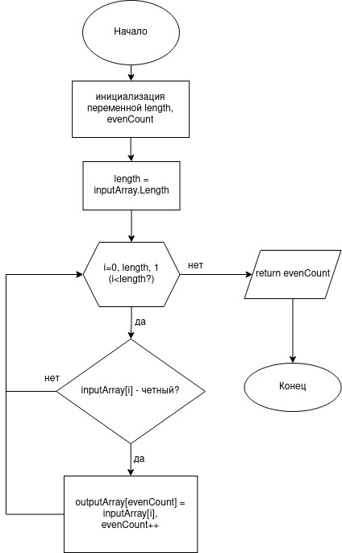

## Задача.
Написать программу, которая из имеющегося массива целых чисел формирует массив из четных чисел. Первоначальный массив можно ввести с клавиатуры либо сгенерировать случайным образом.

## Алгоритм:
1. Инициализируем переменную - размер массива, а также сам массив.
2. Заполняем массив случайными целыми числами от -10 до 10.
3. Выводим в консоль.
3. Инициализируем новый пустой массив такого же размера, что и первоначальный
4. Ищем четные числа в первоначальном массиве, для чего проходимся по всем его элементам
5. Найденные четные числа записываем в выходной массив
6. Проверяем, если не было найдено четных чисел, то выводим надпись, сообщающую об этом.
7. Иначе выводим в консоль содержимое нового массива.

## Блок-схема.

*Ниже приведена блок-схема метода SearchEven*

---

При решении задачи существует два альтернативных варианта:
1. Оптимизация быстродействия с возможным перерасходом памяти (реализовано в приведенном решении). В данном случае мы получаем результат за один проход по исходному массиву.
2. Оптимизация потребляемой памяти со снижением  быстродействия. В таком случае потребуется два прохода по исходному  массиву.
